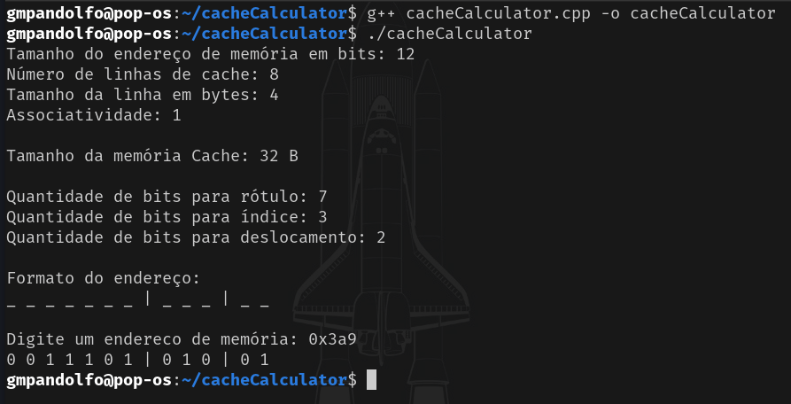

# Cache Calculator 

The Cache Calculator is a program developed in C++ that calculates tag, index and offset sizes based on user input parameters. Besides, it can map the bits of a given hexadecimal value according to the previously provided cache structure.

## **Dependencies**
 - g++ 
  
installation of g++ using apt package manager 

```bash
$ sudo apt update && sudo apt install g++
```

## **Building and running**

```bash
$ g++ cacheCalculator.cpp -o cacheCalculator
$ ./cacheCalculator
```
#

## Expected Result



---
## Authors
- Eduardo Pessolano 
- Gabriel Pandolfo

## License
[GNU GPLv3](https://choosealicense.com/licenses/gpl-3.0/)
